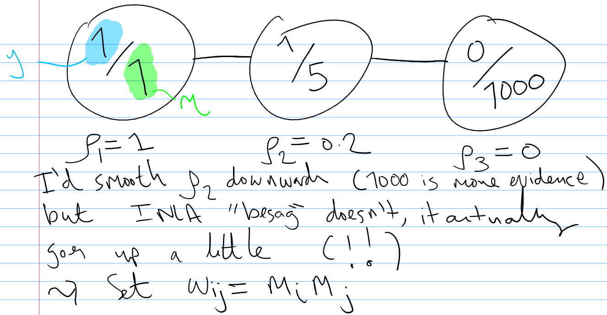

# information-smoothing

Thinking about the appropriateness of spatial smoothing for systems where information is not a property of space (as it would be in an image, say) and is instead a property of individuals embedded in space.
Need to run some more experiments to see if this has any point.

